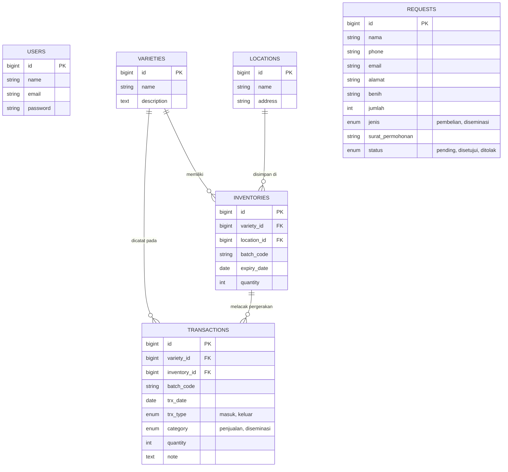

# Dokumentasi Pengembangan Proyek (Development Docs)

Dokumen ini berisi panduan dan penjelasan menyeluruh terhadap aspek teknis arsitektur aplikasi **Sistem Informasi Manajemen Benih Padi (UPBS)**. Dokumen ini dirancang untuk memudahkan para *developer* baru memahami siklus pembuatan, struktur antarmuka, rute navigasi, pengolahan data, hingga alur logika bisnis utamanya.

---

## 1. Alur Pembuatan Proyek (Development Flow)

Pembuatan sistem ini melewati beberapa fase utama pengembangan web berbasis arsitektur *MVC (Model-View-Controller)*:

1. **Inisialisasi Proyek**: Diinisiasi dengan framework Laravel 12 dan PHP 8.2+. Sistem otentikasi dipasang menggunakan **Laravel Fortify** untuk backend yang handal (tanpa memaksakan frontend *scaffolding* tertentu).
2. **Perancangan Skema Database (Migrations)**: Membuat *blueprint* struktur tabel yang mengakomodasi sistem pengelolaan berbasis lot/batch, terdiri dari entitas: *User, Variety, Location, Inventory, Transaction*, dan *Request*.
3. **Penyusunan Relasi Model (Eloquent ORM)**: Menghubungkan tabel-tabel tersebut di dalam `app/Models/` (misalnya relasi satu ke banyak / `hasMany` antara Varietas dan Inventori).
4. **Pembangunan Kontroler (Controllers)**: Menulis logika pemrograman dan pemrosesan data (CRUD master data hingga logika pergerakan stok/transaksi).
5. **Pengembangan Frontend**: Integrasi *Tailwind CSS v4* (melalui modul Vite) dengan *Blade Templating Engine*. Antarmuka dipisahkan menjadi dua porsi: *Landing/Public View* dan *Admin Dashboard*.
6. **Laporan & Export**: Integrasi *package* `barryvdh/laravel-dompdf` untuk mengekspor data *report* transaksi bulanan menjadi file dokumen (PDF).

---

## 2. Skema Database dan Relasi Antar Tabel

Sistem ini menggunakan struktur basis data terelasi untuk memastikan setiap transaksi masuk/keluar tidak merusak integritas *tracking* benih.

### Penjelasan Fungsional Tabel:
- **`inventories`**: Merupakan tabel yang melacak stok **fisik saat ini**. Tidak menyimpan stok gabungan, melainkan stok spesifik per *Batch* atau *Lot* produksi dengan tanggal kedaluwarsanya masing-masing.
- **`transactions`**: Merupakan tabel **Log Historis/Mutasi**. Melacak kapan sebuah stok (dari *batch* tertentu) ditambahkan, maupun kapan dan berapa banyak stok dikeluarkan.
- **`requests`**: Tabel antrean permohonan dari halaman publik. Berdiri independen sebelum diproses admin (status berubah dari `pending` ke `disetujui`).

---

## 3. Breakdown Rute Aplikasi (Routes)

Seluruh pendaftaran *endpoint* URI aplikasi didefinisikan di dalam `routes/web.php`. Secara fungsional, terbagi dalam dua aksesibilitas.

### A. Rute Publik (Akses Bebas tanpa Login)
Dapat diakses oleh siapa saja (masyarakat pengunjung).

| Method | URI (Endpoint) | Controller @ Action | Nama Rute (Name) | Deskripsi Fungsional |
| :--- | :--- | :--- | :--- | :--- |
| `GET` | `/` | *Closure* | `home` | Menampilkan *Landing Page* beserta daftar katalog Varietas Padi. |
| `GET` | `/stok` | `InventoryController@publicStok` | `stok.index` | Menampilkan rekapitulasi sisa stok yang digabungkan (*SUM*) berdasar varietas. |
| `GET` | `/request/create` | `RequestController@create` | `request.create` | Menampilkan antarmuka form pengajuan permintaan benih. |
| `POST` | `/request` | `RequestController@store` | `request.store` | Titik simpan (submit form) pengajuan benih ke dalam sistem. |
| `GET` | `/request/success` | *Closure* | `request.success` | Menampilkan halaman sukses pasca pengiriman *form* (Feedback). |
| `GET` | `/storage/{path}`| *Closure* | - | Rute pembantu untuk merender *file* publik (seperti gambar) langsung dari disk. |

### B. Rute Privat (Middleware `auth`)
Membutuhkan otentikasi (admin *dashboard*). Menggunakan struktur *Resource Routing* dari Laravel.

| Method | URI (Endpoint) | Controller @ Action | Deskripsi Fungsional |
| :--- | :--- | :--- | :--- |
| `GET` | `/dashboard` | `DashboardController@index` | Menampilkan dasbor metrik/statistik awal setelah login. |
| `RESOURCE`| `/varieties` | `VarietyController` | Mengelola data master Varietas Padi (Katalog Benih). |
| `RESOURCE`| `/locations` | `LocationController` | Mengelola data master Lokasi/Gudang tempat penyimpanan. |
| `RESOURCE`| `/inventories` | `InventoryController` | Menampilkan daftar detail stok per *batch/lot*. |
| `RESOURCE`| `/transactions`| `TransactionController`| Menu pencatatan transaksi "Benih Masuk" dan "Benih Keluar". |
| `GET` | `/request` | `RequestController@index` | Menampilkan daftar seluruh antrean permintaan/pesanan benih publik. |
| `GET` | `/request/{id}`| `RequestController@show` | Melihat detail spesifik surat pemohon benih. |
| `PATCH` | `/request/{id}/status`| `RequestController@updateStatus` | Memperbarui Status permintaan (`disetujui`/`ditolak`). |
| `RESOURCE`| `/report` | `ReportController` | Filter bulanan dan mengunduh format cetak laporan (PDF). |

---

## 4. Breakdown Fungsi Kontroller & Pemrosesan Data

Di bawah ini merupakan alur logika pengolahan data pada berbagai *Controller* utama.

### **TransactionController (Logika Inti Pemrosesan Stok)**
Kontroller ini mengatur *lifecycle* ketersediaan stok fisik benih menggunakan kaidah FEFO (First Expired First Out) secara spesifik berdasarkan *Batch/Lot*.

*   **Pemrosesan Transaksi "Masuk" (In):**
    *   Dalam fungsi `store()`, jika `trx_type == 'masuk'`, sistem secara otomatis akan *meng-generate* `batch_code` baru dengan prefix "BATCH-..." secara *random*.
    *   Sistem kemudian melakukan dua proses eksekusi (*Insert*):
        1. Membuat entitas stok/batch baru ke tabel `inventories` berdasarkan `variety_id` dan `expiry_date` yang diberikan.
        2. Mencatatnya sebagai jejak masuk pada tabel `transactions`.
*   **Pemrosesan Transaksi "Keluar" (Out):**
    *   Sistem tidak langsung memotong agregat stok varietas. Saat *form* keluar dibuat, admin akan diberikan daftar *Batch/Lot* (`inventories`) yang spesifik (hanya yang memiliki stok > 0).
    *   Sistem memvalidasi stok. Jika kuantitas keluaran melebihi sisa di *batch* tersebut, transaksi **ditolak**.
    *   Bila valid, maka nilai `quantity` pada tabel `inventories` (di *batch* tersebut) akan dipotong (`decrement()`), dan jejak mutasi disimpan ke tabel `transactions`.
*   **Pemrosesan Koreksi (Update/Destroy):**
    *   Memiliki mekanisme "Undo/Reversi Stok". Jika sebuah log transaksi diubah atau dihapus, sistem akan secara cerdas mengembalikan saldo inventori (`increment()` atau `decrement()`) pada *batch* yang bersangkutan guna memastikan akurasi data tak terganggu.

### **InventoryController**
Bertanggung jawab atas pemantauan visibilitas data stok.
*   **Aksi Frontend (`publicStok`)**: Melakukan konversi format *view*. Karena pengunjung tidak membutuhkan rincian rumit *batch-code*, sistem melakukan injeksi *Query Raw* SQL agregasi `SUM(quantity)` berlandaskan `variety_id`.
*   **Pembersihan Stok Otomatis**: Pada fungsi `store/update`, jika admin mengatur kuantitas menjadi *0 (Nol)*, maka *record* `inventories` tersebut secara otomatis dihapus dari *database* (sebagai bentuk *Garbage Collection* agar data stok nol tidak membebani komputasi visual).

### **RequestController**
Menangani pengumpulan prospek atau permintaan calon pelanggan.
*   Penyimpanan file *surat_permohonan* diatur menggunakan sistem *Storage Laravel* (`public` disk).
*   Memiliki fungsi *Custom Endpoint* yaitu `updateStatus()` yang merubah status bawaan (`pending`) menjadi validasi akhir pengelola (`disetujui` atau `ditolak`).

### **ReportController**
Menangani kompilasi data (Filter rentang waktu) di tabel *transactions*. 
Mengirim set parameter dan koleksi hasil filter ke *package domPDF*, me-*render* tampilan HTML (dari Blade Report UI) ke resolusi *A4 PDF stream* yang dapat diunduh (download).

---

## 5. Front-End (Antarmuka dan Visual)

Tampilan aplikasi tidak bergantung pada file statis lama (CSS terpisah dan panjang), melainkan memanfaatkan kapabilitas *Utility-First CSS*:

1. **Tailwind CSS v4 & Vite**:
   - Berperan krusial dalam mempercepat *development* rupa (desain responsif). 
   - Konfigurasi `vite.config.js` dihubungkan ke `@tailwindcss/vite` untuk *Hot Module Replacement* (HMR).
   - Diimplementasikan mode gelap (*Dark Mode*) bagi kenyamanan penggunaan backend oleh admin, yang dicapai dengan *pseudo-classes* bawaan (`dark:bg-gray-800`, `dark:text-white`).
2. **Template Blade Laravel**:
   - Pembagian modul. *Header*, *Sidebar*, dan bingkai dasar dijadikan komponen tata letak (*layout/app.blade.php*).
   - Seluruh konten antarmuka halaman publik dan *form request* diletakkan berdampingan secara mandiri untuk mencegah tercampurnya aset navigasi backend ke pengunjung luar.
